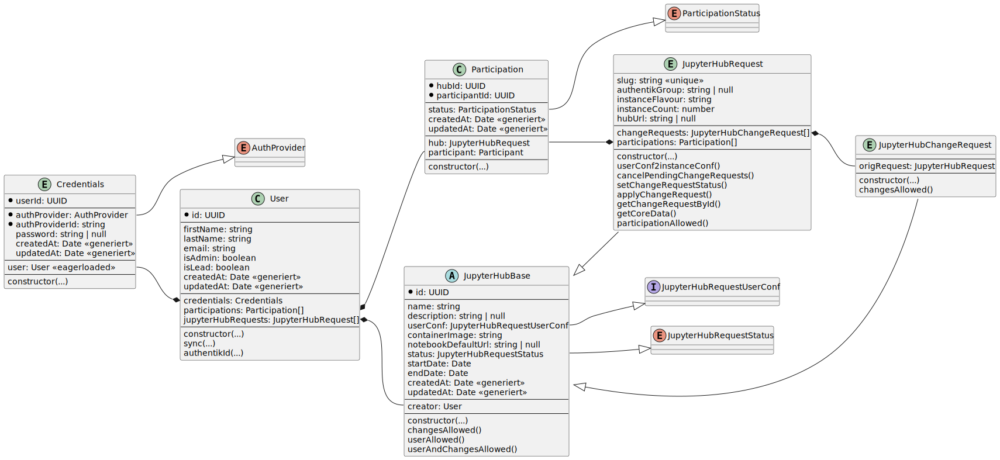

# JHaaS Portal Backend

This repository contains the Code for the JHaaS Portal Backend.

## Gettings started

This repository contains a container configuration to allow development via tools like podman and docker. As podman and docker are handling user id mapping totally different, there are do compose files, one for each.

Depending of which tool you want to use, create a link to the compose file, e.g.:

```bash
# for docker
ln -s compose.docker.yml compose.yml

# for podman
ln -s compose.podman.yml compose.yml
```

If you also want to develop with a local authentik instance, `cd` into `authentik` and start the composition.

## JHaaS Overview

This is a simple overview about JHaaS.


## Use Case Diagram

This is a simple Use Case Diagram for overview purposes. It simplifies several steps.


## Entity-Relation Diagram

This is a simple ER Diagram for overview purposes. It omits all primitive fields.


## Class Diagram

This is a simple Class Diagram for overview purposes. It omits deeper implementation details.


